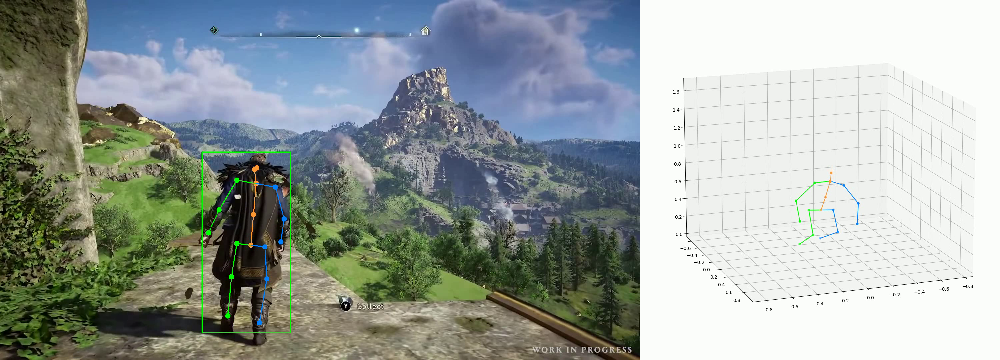
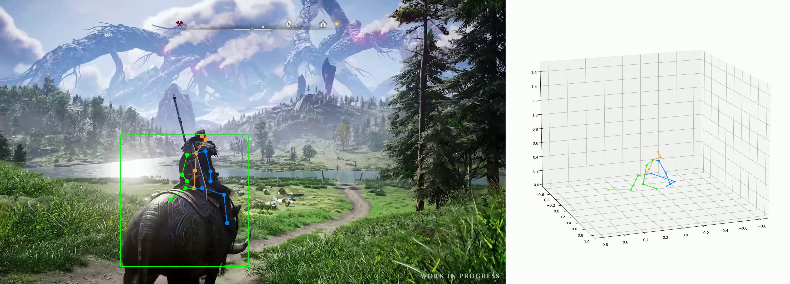

```{r, chunk, include=F, cache=F}
knitr::read_chunk("report.r")
```

```{r init, include=F, cache=F}
```

# Introduction

## Background

Open-world games, where players are allowed to interact with their surrounding environments or non playable characters (NPCs) in a free way with almost no limitations have become one of the most popular genres of game in recent years. One of the reasons for that success is the emotional attachment that the player develops for the game characters. That attachment comes from the fact that each action the character took follows the control of the player, or in other words, the character reflects the behavior of the player, especially in open-world games where there are no limitations. That attachment has even been the subject of a psychological study [@emo-attach].

Given this phenomenon, a new trend is rising in the gaming industry: customizable character appearance, by which players can modify their avatars' clothes, face, skin, and other physical characteristics. We can see it already in 2D games like "The Sims" and recent 3D games such as "Cyberpunk" or a more ambitious project "Metaverse" from "Meta". The uniqueness of the customizations they offer reinforces the sense of attachment which in-turn keeps players engaging with these games for a longer time.

However, today's games do not support enough options to satisfy the players' demand for customizability, which often leads to game’s modifications, in which gamers modify the code or assets of a game to achieve their desirable result. The aim of our project is to create a universal filter which can replace a selected game character with another avatar of the player's choice, in real time, without any noticeable lag or alteration of the game's source code. Our secondary goal is to extend this replacement capability to figures, whether they are avatars or real people, in videos and still images.

## Current method

In fact, replacing the appearance of an object in general is already feasible by video editor programs like: Adobe Premier Rush, iMovie, etc. This gives us high-quality results but also takes a lot of time to render the final result. Furthermore, this process requires a lot of manual effort as well as pre-recorded gameplay footage which is not in real time.

In the gaming industry, this idea is also achievable through altering the assets of the game which is usually referred as modding. The result quality is not as high as done manually by video editors, but still quite plausible (figure \@ref(fig:elden-ring-mod)).

(ref:title-elden-ring-mod) Shrek vs Homer Simpson in Elden Ring from the video [Elden Ring but ruined by mods](https://www.youtube.com/watch?v=b_FKkxVJfZk)

```{r, elden-ring-mod, fig.align="center", out.width="70%", fig.cap="(ref:title-elden-ring-mod)"}

```

However, this method requires modifying the game's code, particularly where the game assets are stored, which is not uniform across all games. Additionally, the assets of each game may come in different formats and require different handling. As a result, this method only works for specific games and is not a universal solution that this project aims to achieve.

## Automatic replacing

Our goal is to have the selected character (source character) which is appearing on the current frame of the source replaced by another character (destination character) of user choice in real time.

We will divide our problem into three sub-problems: pose estimation, skeleton retargeting and mesh skinning. Our pipeline will be as follow:

- Estimating the pose of the source character.
- Retargeting the pose obtained from the previous step to the pose of the destination character.
- Adjusting the mesh of the destination character according to the new pose.

We then explore different method to solve each sub-problem and use the criteria below to evaluate them:

- Work with any video streaming source, where the input is their frame.
- Work with real time constraints, the method can only use the current frame at this timestamp as well as past frames and knows nothing about the future information.
- Work without noticeable lag.
- Fully automatic or minimal manual work required.

We will go to each problem in detail in the next sections.

# Pose estimation

## Problem formulation

Given an image, we want to accurately detect several main joints of people inside that image. More specifically, the algorithm takes an image and returns the position of each joint of each person detected in the input image. Furthermore, the number of people that can be detected (one or many), the number of joints, which joints are returned and the coordinate space (2D/3D) of the position depends on each algorithm.

(ref:title-openpose-example-output) Pose estimation example output from OpenPose [@openpose]

```{r, openpose-example-output, fig.align="center", out.width="70%", fig.cap="(ref:title-openpose-example-output)"}

```

Since we need the output coordinate space in 3D, models that output 2D and 3D have to be treated differently. We will go a separate subsection for each of them. In the end of this section, according to our observations, two issues that all models suffer from will be discussed in [Accuracy and consistency issue].

## 2D

Output from 2D models will then be lifted to 3D by another model which will be discussed in [3D Lifter]. There are several 2D models that we have tested, but we only present here two most potential models according to our criteria: OpenPose [@openpose] and YOLOv7 [@yolov7].

### OpenPose

OpenPose is a real-time multi-person system for detecting human body, hand, facial, and foot keypoints (joints) on single images. In this project, we are interested in the body keypoints, which gives us enough joint information we need. There are a lot of models that could be used in combination with OpenPose, but we only try body_25, the model whose accuracy is highest among all the official models and its experimental variant body_25b which even has higher accuracy.

The output joints and the connections between them of each model are shown in figure \@ref(fig:openpose-output).

```{r, openpose-output, fig.show="hold", fig.align="center", out.width="40%", fig.cap="OpenPose joints map", fig.subcap=c("body\\_25", "body\\_25b")}


```

#### Performance

Although OpenPose can achieve up to 24 fps on some high-end hardwares, its fps on mid-end hardwares is around 10fps. For example, in the standard Google Colab GPU environment, the algorithm took 1150 seconds to process a video whose length is 4 minutes and 10 seconds, which is about 13 fps. Unfortunately, even with 24 fps, it is still not fast enough since we have two more big steps that also take some time.

Hence, we try to optimize the speed of OpenPose by using TensorRT^[https://developer.nvidia.com/tensorrt]. TensorRT is an SDK from NVIDIA for high-performance deep learning inference, includes a deep learning inference optimizer and runtime that delivers low latency and high throughput for inference applications. It takes a serialized machine learning model file (in our case OpenPose is in Caffe^[https://caffe.berkeleyvision.org/] format) and compiles that model into another format which can be loaded into TensorRT and offers great speed up of inference time (up to 36 times) compared to inference without TensorRT. Three disadvantages of TensorRT are:

- Only available on NVIDIA hardware. This is not an universal solution as in our objective but since the GPUs from NVIDIA are very popular in gaming communities, we consider it acceptable for now.
- The compiled model only works on the hardware where it is compiled. Users have to compile the model themselves.
- The compilation process can take some time. Fortunately, the compiled model can be serialized into a file and loaded later, so users only need that process once per hardware.

Since OpenPose does not offer an official TensorRT solution (PR [#285](https://github.com/CMU-Perceptual-Computing-Lab/openpose/pull/285)), we have to do it ourselves by extracting the input preprocessing (normalization, resizing) as well as output features parsing (part confidence maps, part affinity field, bipartite matching). After implementing OpenPose with TensorRT, with the same default configuration of OpenPose, we got 10 fps on a NVIDIA GTX 1050 TI 4Gb (an mid-end card that was released in 2016) while the same code from official OpenPose does not run because of an out of memory issue. On more powerful and newer hardware, the code can achieve the desired performance we want.

#### Accuracy

One more major issue with OpenPose is that the accuracy is not good enough. Here we shows an example output in figure \@ref(fig:openpose-accuracy-output) to show why it is not as good as we expected. OpenPose wrongly detected something non-human as human while failing to detect the actual character. Here we have both false positives (indicating non-human as human) and false negatives (failing to detect the presence of actual human poses). The input image is gameplay footage from Assassin's Creed Valhalla where the main character is running.

```{r, openpose-accuracy-output, fig.show="hold", fig.align="center", out.width="50%", fig.cap="OpenPose low accuracy", fig.subcap=c("body\\_25", "body\\_25b")}


```

The solution for this issue is to tweak the configuration of OpenPose to increase the accuracy with the cost of performance. However, since we are working under real time constraints, this is not a feasible option.

#### Consistency

The final major issue with OpenPose is the consistency across frames. Figure \@ref(fig:openpose-consistency-output) shows OpenPose body_25b output at two timestamps whose difference is 20 milliseconds. OpenPose gives a very different output between two frames even though they are almost indistinguishable. The input image is gameplay footage from Assassin's Creed Valhalla.

```{r, openpose-consistency-output, fig.show="hold", fig.align="center", out.width="50%", fig.cap="OpenPose lack of consistency", fig.subcap=c("frame 1", "frame 2")}


```

OpenPose has a tracking option that helps increase the consistency across frames. But with that option, OpenPose can only detect one person at a time. Porting that to TensorRT also requires a lot of effort. Given our limited resources, we did not consider that option.

### YOLOv7

YOLO (You Only Look Once) is a family of general real time object detection solutions. YOLOv7 offers a variant which can be used to do multi-person pose estimation.

The output joints and the connections between them are shown in figure \@ref(fig:yolo-output). It follows the same format in the COCO dataset [@coco].

```{r, yolo-output, fig.align="center", out.width="15%", fig.cap="YOLOv7 joints map"}

```

YOLOv7 also suffers the same problems as OpenPose. We will document it shortly in the following sections.

#### Performance

YOLOv7 can only run with real time speed on high-end hardware. For the same video, on the same Colab GPU environment, it can only run with 5 fps.

YOLOv7 has some support for accelerating with TensorRT. However, since the problem with accuracy and consistency still persists, we did not try this model with TensorRT.

#### Accuracy

Figure \@ref(fig:yolo-accuracy-output) shows YOLOv7 output with the input is the same as of OpenPose. Given a similar frame, YOLOv7 did not detect anything.

```{r, yolo-accuracy-output, fig.align="center", out.width="50%", fig.cap="YOLOv7 low accuracy"}

```

Although YOLOv7 does not detect anything, we can not still conclude that it has lower accuracy than OpenPose because both models do not have the consistency in their outputs and are very sensitive with only small changes of the input. On the other hand, there are no options to change the accuracy-performance tradeoff rate in YOLOv7.

#### Consistency

Same as OpenPose, given two frames where the time difference between them are 84 milliseconds, YOLOv7 gives two completely different results.

```{r, yolo-consistency-output, fig.show="hold", fig.align="center", out.width="50%", fig.cap="YOLOv7 lack of consistency", fig.subcap=c("frame 1", "frame 2")}


```

As opposed to OpenPose, YOLOv7 does not have a built-in tracking option. However there are instructions to add an external tracking mechanism with the cost of performance.

### 3D Lifter

To go from 2D to 3D, we use [@videopose3d]. It takes the 2D positions of joints and produces the positions of these joints in 3D coordinate. The number of joints and the order of joints has to follow a specific format, hence requiring an interpolation step to convert the output of the previous step into a compatible input. The performance of this model is very fast, since its input is the positions of joints, which is relatively small compared to an image.

An example output of this model is shown in figure \@ref(fig:videopose3d-output). The character is walking normally while the 3D output gives us a different view of the skeleton. It could be admitted to be a crouching pose more than a walking one. The shape of legs is a big difference between those two.

```{r, videopose3d-output, fig.align="center", out.width="100%", fig.cap="VideoPose3D output"}

```

We can see that the VideoPose3D gives us a rough result if we have all 2D joint positions. However, when the 2D pose detector fails to detect one joint, the model will not work (issue [#14](https://github.com/facebookresearch/VideoPose3D/issues/14)). Although forcing the 2D models to always output all joints is possible, that adds a lot of noises to their output. Furthermore, these joints are likely not correct, which heavily affects the 3D estimated positions of other joints.

In figure \@ref(fig:videopose3d-missing-output), the original pose concerns a riding human while we are having a "practicing yoga" like pose from the output. The fact that forcing the model to give a non-exist output with prediction creates a huge gap between the original pose and the prediction leads to an abnormal estimation of the 3D lifting model, when it has to deal with an "abnormal" input.

```{r, videopose3d-missing-output, fig.align="center", out.width="100%", fig.cap="VideoPose3D output when some joints are missing"}

```

Unfortunately, occlusion or the situation where parts of the character are not shown in input image, due to them being out of the camera or because they are covered by something is quite common in game, especially in open-world games. In addition, since the accuracy of our pose detectors is not really good, the error from pose detectors is propagated to the 3D lifter without proper handling as the 3D lifter does not have any information about the previous model and the input image. Therefore, we decide that this combination is not good enough and we want a 3D model that is aware of the input image.  Hence we move to another idea, which is directly regressing 3D pose from the input image.

## 3D

We use MediaPipe [@mediapipe] to directly regress the 3D positions of the joints. MediaPipe offers open source cross-platform, customizable ML solutions for live and streaming media. In addition to the basic body joints, MediaPipe can also give us tracking mechanism, the face mesh (a reconstruction of the surface of the face), the positions of joints on our hands (including finger joints) as well as an image segmentation to distinguish between the person inside the input image and the background. The limitations of this method is that it can only detect one person at a time.

The output joints and the connections between them are shown in figure \@ref(fig:mediapipe-pose-output) and \@ref(fig:mediapipe-hand-output).

```{r, mediapipe-pose-output, fig.align="center", out.width="60%", fig.cap="MediaPipe pose joints map"}
knitr::include_graphics("figures/mediapipe-pose-output.png")
```

```{r, mediapipe-hand-output, fig.align="center", out.width="60%", fig.cap="MediaPipe hand joints map"}
knitr::include_graphics("figures/mediapipe-hand-output.png")
```

### Performance

MediaPipe has a very high performance. It can satisfy real time constraints on a wide range of hardware, even on CPU or mobile hardware. With face mesh, hand pose, body pose and image segmentation, it could run up to 60 fps, which leaves us plenty of room to solve two next problems.

### Accuracy

Since the size of this model is small, it is expected that the accuracy of this model is not very high. It usually fails to detect the person in the input image. However, once it get the person, the 3D pose it produce is closer than the one of VideoPose3D. Figure \@ref(fig:mediapipe-accuracy-output) shows MediaPipe output when it is given the same frame as VideoPose3D. The legs are more natural than the previous one.

```{r, mediapipe-accuracy-output, fig.align="center", out.width="80%", fig.cap="MediaPipe output"}

```

One big major issue with MediaPipe is however occlusion. When there is an occlusion, for example in figure \@ref(fig:mediapipe-occlusion-output) the character is riding an animal, MediaPipe output pose will give a completely weird pose.

```{r, mediapipe-occlusion-output, fig.align="center", out.width="80%", fig.cap="MediaPipe output when there is an occlusion"}
knitr::include_graphics("figures/mediapipe-occlusion-output.png")
```

### Consistency

Since MediaPipe has an built-in tracking, it can track and follow the character across frames when they are doing some simple motions and provide more consistency than previous models. Unfortunately, for more complex motions, it usually completely fails to detect the character inside the input image.

## Accuracy and consistency issue

### Accuracy issue

We see that all 4 models we tested here have low accuracy regardless of their size or architecture. One big reason for that is the dataset they are trained on does not cover many properties of gameplay footage in general. We can divide into two main properties, the characters themselves and the surrounding environment.

#### The characters

This is usually the reason why we have false negatives (fail to correctly detect the pose of the characters or completely miss them).

First, it is because of their appearance, or more specifically, their skin, their clothes, their items or their weapons are completely different from what we can find inside the dataset. Figure \@ref(fig:appearance-comparison) shows example images from the COCO dataset, which is used to train both OpenPose and YOLOv7 and example outfits in the game Assassin's Creed Valhalla. There is a clear distinction between them.

```{r, appearance-comparison, fig.show="hold", fig.align="center", out.height="15.5%", fig.cap="Appearance comparison", fig.subcap=c("COCO dataset", "Assassin's Creed Valhalla")}


```

Secondly, the actions and motions of the characters are also far away compared to what we have in the dataset, therefore, less likely to be detected correctly, for example jumping from a high place or combatting.

Thirdly, the skeleton of many characters inside games are also different from the usual human body. We can take the rabbit from Rabbids game as an example, it has a similar skeleton structure as ours, but the length of its head is bigger than the length of its body.

#### The environment

The surrounding environment is one of the biggest reasons for the noise in our output. As we can see the environment in the COCO dataset is also quite usual. However, the environment in games is a product of imagination and therefore has no limitations. We can see in figure \@ref(fig:env-output), all three models mistakenly detect the cave as a human.

```{r, env-output, fig.show="hold", fig.align="center", out.width="33%", fig.cap="Cave mistakenly detected as human", fig.subcap=c("OpenPose body\\_25b", "YOLOv7", "MediaPipe")}
knitr::include_graphics("figures/openpose-body25b-env-output.png")


```

Pose detectors also do not work very well in environments with low light-level, which is quite common in open-world games.

#### Solution

For all the reasons above, the only solution is to retrain the models on a different dataset which also takes into account the unusuality and diversity of the gaming world. Finally, we show a simple image, with a human-like skeleton but no model can detect anything from it in \@ref(fig:rabbid).

```{r, rabbid, fig.align="center", out.width="30%", fig.cap="The main character of the game Rabbid"}

```

### Consistency issue

An example for this issue that we usually meet is the left and right detection. Especially when the character is facing backward. Without tracking, the model can then assign the left leg of the pose to one leg in a frame and then assign that to another one in the next frame. More generally, we want to have a mechanism that ensures the pose difference between two frames with a small time difference is not too big. However, we have not found a complete solution for this problem. We will leave it for future improvement.

# Skeleton retargeting and skinning

## Problem formulation

### Skeleton retargeting

Given two skeletons (source and destination), find the new positions of each joint / bone of the destination skeleton such that the destination skeleton mimics visually the source skeleton.

```{r, retargeting-process, fig.show="hold", fig.align="center", out.width="30%", fig.cap="Retargeting process", fig.subcap=c("Source skeleton", "Destination skeleton", "Retargeted skeleton")}

knitr::include_graphics("figures/destination-skeleton.png")

```

Each bone in the source and destination can have different bone length (the distance between connecting joints). More generally, these two skeletons can have different numbers of bones, but since our resources are limited, we only focus on the case where two skeletons have the same architecture.

### Mesh skinning

Given a skeleton and a mesh, adjusting the mesh such that it visually matches the pose of the skeleton.

```{r, skinning-process, fig.show="hold", fig.align="center", out.width="30%", fig.cap="Skinning process", fig.subcap=c("With skeleton", "Final result")}


```

Note that a mesh is a collection of 3D points (vertex) and they act like pixels in a 2D image. To move a mesh with a skeleton, the general process is as follow:

- Attach each vertex with one or several bones and for each bone attached to that vertex, assign a weight (from 0 to 1), the sum of weight of all attached bones of one vertex must equal to 1.
- Once a bone moves, get the global transformation of that bone (rotation, transition and scaling).
- From the global transformation of these bones, apply these transformations on each vertex based on the weight of each bone attached to that vertex (if a bone is not attached to that vertex, we consider its weight is 0). The final transformation on that vertex could be the weighted sum of all transformations or more complex algorithms. Frown now on, we assume that there is no scaling.

From the problem formulation above, we see that the skinning process requires the transformation of each bone, not the final position after transforming. Hence, we need a retargeting method that can output transformation matrices instead of final joint positions. This will be discussed more in later sections.

Another issue is the need of a rendering engine to render the skinned skeleton. It should render and return the rendered result as an in-memory buffer since saving that result to a file and reloading it into memory (to place it on the original image) takes too much time. In addition, the renderer has to:

- run independently without using any external application.
- run without the need of opening any GUI window.
- provide programmatically API.

```{r, renderer-comparison}
```

Table \@ref(tab:renderer-comparison) shows a comparison between several renders we tried. All rendering engine mentioned above can run without a GUI. A "x" means "yes". Since our project is based mostly on Python, we choose Pyrender and implement the skinning code based on the code of Libigl. The skinning method we choose is dual quaternion skinning [@dqs]. For Three.js, since one of the retargeting libraries is written in Javascript, and it also offers better functionalities compared to other libraries (except Blender), we also use that in combination with the Javascript retargeting library.

Now we will move to the retargeting methods we have explored.

## Physical-based methods

First we note that computing the matrix transformation from the positions only is not enough. An example is illustrated in figure \@ref(fig:rotate-example). We can see that the targeted positions can be achieved either by rotating the parent bone in its own y-axis or rotating the child bone with respect to the parent one. Even though their final positions are not different, there will be a big difference when we apply these transformations to the skinning process.

```{r, rotate-example, fig.show="hold", fig.align="center", out.width="30%", fig.cap="Simple bones system", fig.subcap=c("Original pose", "Rotate parent bone", "Rotate child bone") }


knitr::include_graphics("figures/rotate-child.png")
```

### KalidotKit

KalidoKit is a blendshape and kinematics solver for Mediapipe face, eyes, pose, and hand tracking models. It takes predicted 3D landmarks and calculates simple euler rotations with respect to parent bone and blendshape face values. The computed value will then feed into Three.js to accordingly adjust the mesh. However, since this is a pure physical mechanism, the computed euler rotation might be far away from the truth value. We show in figure \@ref(fig:kalidokit-output) an example output of it. The detected pose is on the upper left corner of the screen. We can see that the detected pose is raising its hand parallel to its head, but the character only raises its hand to a lower height and forms a different pose compared to the detected pose.

```{r, kalidokit-output, fig.align="center", out.width="50%", fig.cap="KalidoKit output"}

```

### Gradient descent inverse kinematic

In this method, we try to solve the following inverse problem:

Given two poses of a skeleton, compute the local matrix transformations with respect to the parent bone of each bone to transform the first pose to the second pose. Formally, given $n$ bones, $C^1$ is a matrix of size $3 \times 2n$ that contains the positions information of each bone (bone start and bone end) of the first pose, and $C^2$ is the same as $C^1$ for the second pose, $P$ is a vector of size $n$ such that $P_i$ gives the index of the parent bone of the $i^{\text{th}}$ bone and $i > P_{i}$, if a bone has no parent, it is assigned $-1$, find the local rotations $R^l$ and translations $T^l$ of each bone to transform the first pose to the second one.

These transformations will be converted to global transformations and rotations and then used as the input for the skinning process. Before we start discussing our solution, some preliminaries will be presented first.

#### Global matrix method

A global matrix transformation is a transformation that applies to an object with respect to the origin of the coordinate system $(0, 0, 0)$ and a local matrix transformation is a transformation that applies with respect to the parent bone. The global matrix transformation for the above problem can be computed directly in algorithm \@ref(alg:global-matrix-compute). This algorithm can also be used to transform two skeletons with the same structure but different size. The final skeleton will have the same root position as of the first skeleton, same bone length as the second one, and match visually the pose of the first one.

```{=latex}
\begin{algorithm}
\caption{Global matrix transformation computation}\label{alg:global-matrix-compute}
\KwIn{$n$, $C^1$, $C^2$, $P$}
\KwOut{$R^g$, $T^g$}

$C^T$ a matrix of the same shape as $C^1$\;

\For {$i \gets 1$ \KwTo $n$} {
  $v_1 \gets C^1_{2i + 1} - C^1_{2i}$\;
  $v_2 \gets C^2_{2i + 1} - C^2_{2i}$\;
  $q \gets$ the quaternion that rotates the unit vector of $v_1$ to the unit vector of $v_2$\;
  $R^g_i \gets q$\;
  \eIf {$P_i < 0$} {
    $T^g_i \gets C^2_{2i} - q \times C^1_{2i}$\;
    $C^T_{2i} = C^2_{2i}$\;
  }{
    $T^g_i \gets C^T_{2p + 1} - q \times C^1_{2i}$\;
    $C^T_{2i} = C^T_{2p + 1}$\;
  }
  $C^T_{2i + 1} \gets q \times C^1_{2i + 1} + C^T_{2i} - q \times C^1_{2i}$\;
}
\end{algorithm}
```

However, as pointed out earlier, there are many ways to rotate the bones. Hence, the final skinned skeleton might be weird. An example of that shows in figure \@ref(fig:rotate-global). The final skeleton is the third skeleton in figure \@ref(fig:retargeting-process). We can see that the ground truth rotates its hips, as well as its shoulders while the global matrix method only rotates the shoulder. Although two skeletons' positions are very close, the skinned result looks completely different. Therefore, in order to have better control of the rotation, we have to work with the local transformation matrix.

```{r, rotate-global, fig.show="hold", fig.align="center", out.width="30%", fig.cap="Skinned result of the global matrix computation algorithm", fig.subcap=c("Ground truth", "Global matrix") }


```

#### Forward kinematic

Forward kinematic is a process that takes the local rotations $R^l$ and translations $T^l$ and returns the global position of the skeleton after applying these transformations. Algorithms \@ref(alg:forward-kinematic) describe the process.

```{=latex}
\begin{algorithm}
\caption{Forward kinematic}\label{alg:forward-kinematic}
\KwIn{$n$, $C$, $P$, $R^l$, $T^l$}
\KwOut{$R^g$, $T^g$, $C^T$}

$C^T$ a matrix of the same shape as $C$\;

\For {$i \gets 1$ \KwTo $n$} {
  \eIf {$P_i < 0$} {
    $R^g_i \gets R^l_i$\; 
    $T^g_i \gets C_{2i} - R^l_i \times C_{2i} + T^l_i$\;
  }{
    $R^g_i \gets R^g_p \times R^l_i$\;
    $T^g_i \gets T^g_p - R^g_i \times C_{2i} + R^g_p \times C_{2i} + R^g_p \times T^l_i$\;
  }
  $C^T_{2i} \gets R^g_i \times C_{2i} + T^g_i$\;
  $C^T_{2i + 1} \gets R^g_i \times C_{2i + 1} + T^g_i$\;
}
\end{algorithm}
```

Since a child bone is always attached to its parent, we will always set $T^l_i$ to $0$ if $P_i > 0$, this way, we can guarantee the structure of the bone after transformation.

#### Inverse kinematic

Since we have the forward function, we can solve the problem above by using it and gradient descent. We use Jax [@jax], a Python library that supports automatically differentiating python functions for backpropagation and offers high performance hardware optimization. It has the same limitations as TensorRT, except that it is available on all hardware. However, the compilation process can not be serialized into a file (issue [#476](https://github.com/google/jax/issues/476)) and needs to be run every time while the code is initializing.

The gradient descent approximately 0.5 second on a NVIDIA GTX 1050 TI 4Gb to get to the destination pose for the first run. From there, each subsequent run will take much less time given that the destination pose in the next frame only differs a little bit from the previous frame. Gradient descent will converge faster with the initial point being the local transformations from the previous frame (or return immediately if the difference between two frames is too small).

Figure \@ref(fig:inverse-kinematic) shows the skinned output of this method. Although the result is not too good, we see that the legs are better than in the global matrix method. We can also import some constraints on the local rotations of each bone so that it produces a more natural result. Unfortunately, we did not have enough time for it and left it as a future improvement.

```{r, inverse-kinematic, fig.show="hold", fig.align="center", out.width="30%", fig.cap="Skinned result of the inverse kinematic method", fig.subcap=c("Ground truth", "Global matrix", "Inverse kinematic") }


```

Finally, for a completely retargeting solution, given two skeletons of different size, we first retarget into an immediate skeleton that has the same size as the destination one, and then use the inverse kinematic method to get the right matrix transformation for skinning.

## Deep learning

For a deep learning based method, we found three papers that return the matrix transformation in [@cvpr], [@deepmotion] and [@motionet]. However:

- [@cvpr] does not provide a pretrained model.
- [@deepmotion] has problem with skinning (issue [#205](https://github.com/DeepMotionEditing/deep-motion-editing/issues/205)). Furthermore, the model are trained specifically on some characters and does not work well on a generalized context (issue [#43](https://github.com/DeepMotionEditing/deep-motion-editing/issues/43)) where the unseen skeleton has too different size compared to the skeletons used in the training phase.
- [@motionet] also suffers from the same problem with the rotation as mentioned above ([limitations](https://github.com/Shimingyi/MotioNet#limitations)).

# Deliverable and further improvement

## Deliverable

We use MediaPipe, KalidotKit and Three.js to implement a demo for this project. Figure \@ref(fig:demo-output) shows an output of it. The video is from the game Assassin's Creed 3.

```{r, demo-output, fig.show="hold", fig.align="center", out.width="50%", fig.cap="Demo output", fig.subcap=c("Original video", "Result") }


```

Compare to our [original goal](#automatic-replacing), this method can

- Work with any video streaming source, where the input is their frame.
- Work with real time constraints, the method can only use the current frame at this timestamp as
well as past frames and knows nothing about the future information.
- Work without noticeable lag. On a NVIDIA GTX 1050 TI 4Gb, it could run up to 25fps.
- Fully automatic or minimal manual work required. No manual work is required.

However, the result of this method does not look natural nor blend well with the surrounding environment in the picture. Furthermore, it can only detect and replace correctly when the character's pose is easy such as walking and falling to do so with more complex poses such as riding an animal.

Compared to our original goal, this method has the ability to:

- Work with any video streaming source, where the input is their frame.
- Work with real time constraints, the method can only use the current frame at this timestamp as
well as past frames and knows nothing about the future information.
- Work without noticeable lag, achieving a frame rate of up to 25fps on a NVIDIA GTX 1050 TI 4Gb.
- Fully automatic with no manual work necessary.

However, the result of this method does not look natural and does not blend well with the surrounding environment in the image. Additionally, it can only accurately detect and replace characters when their pose is simple, such as walking, and struggles with more complex poses, such as riding an animal.

## Improvement

From the demo and throughout the report, it is observed that there is a lot of room for improvement. First, we need to improve the accuracy as well as consistency of the pose detectors, by training them on a dataset that contains gameplay features and implementing a better mechanism for keeping consistency. This is the most important improvement since it affects all other steps. Second, we want to find a retargeting method that has support for a better skinning mechanism. And finally, although this is not mentioned above, a better algorithm to blend the mesh renderer result into the input image such that it looks more natural would also be a major improvement.

# Conclusion

In this project, we have examined various techniques to address three primary challenges: pose estimation, skeleton retargeting, and mesh skinning. In terms of pose estimation, we have identified a common issue among all models, where the datasets they were trained on did not account for the diversity and unusuality present in the gaming world. Additionally, we have observed a problem with the consistency of the model output, where the pose in the previous frame and the current frame can be vastly different. Another issue is that the 3D pose that is inferred from the 2D pose is not adequate for our purposes. Similarly, skeleton retargeting and mesh skinning also face challenges related to a lack of information to reconstruct the rotation matrix, leading to failure in the skinning process.

Despite the extensive work we have done, we have yet to find a method that can provide a perfect solution to these problems. One potential next step for this project could be retraining a model on a dataset that includes gameplay footage from various games. This is something we have considered for a long time, but were unable to do so due to limited resources and time. Furthermore, the gradient descent inverse kinematics could also be enhanced for a better estimation of the rotation matrix with local rotation limit.

We believe that with further research and development, the methods we have explored so far will be improved, and we can eventually achieve a perfect filter.

\newpage
